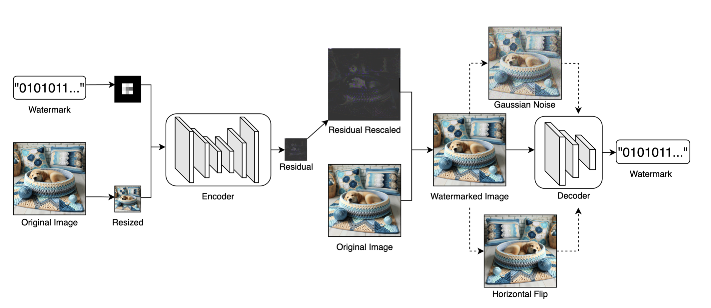

# Concrete-Watermarking

This repo contains a *fast* and *robust* watermarking system, encrypted with ZAMA's Fully Homomorphic Encryption (FHE) technology for privacy-preserving AI.

Features:
- **Fully End-to-End**: Providing an image and a secret, the model will perform watermarking end-to-end, without any manual intervention.
- **Fully FHE-Compatible**: The entire encoding model is FHE-compatible. In other words, the entire watermarking process is performed on encrypted images, ensuring privacy-preserving AI.
- **Quantization-Aware Training**: The model is trained with Quantization-Aware Training (QAT) to ensure compatibility with FHE.
- **Ultra Fast**: The inference time is less than 20 minutes on a modern CPU (296368 PBS).
- **Contain Training Scripts**: We provide pretrained weights for models, as well as training scripts to reproduce the results.

## Methodology

We adopt a recent State-of-the-Art (SOTA) watermarking method, [InvisMark](InvisMark: Invisible and Robust Watermarking for AI-generated Image Provenance)(introduced at WACV2025 by Microsoft), to design our watermarking process. 
InvisMark enables invisible and robust watermarking for AI-generated image provenance.

The process begins by passing the watermark through a preprocessing layer and concatenating it with a resized cover image.
A QAT-optimized MUNIT-based encoder then generates watermark residuals, which are upscaled and added to the original image to produce the watermarked image. 
To ensure compatibility with Brevita, we implement QAT-compatible `Upsample`, `Repeat` and `Padding` modules within the encoder.
For robustness, a top-k noise selection mechanism is introduced. 
This involves selecting the most challenging noises from a predefined set (e.g., RandomResizedCrop, Rotation, JPEG Compression, GaussianBlur, etc.) that result in the poorest watermark recovery. 
These noise-induced losses are incorporated into the watermark training process. 
The overall training loss is defined as the mean squared error between the original and recovered watermarks.

During inference, the secret is first encoded using an error correction code (e.g., Hamming code for simplicity and speed, though other ECC methods can be easily substituted). 
The watermarked image and encoded secret are then encrypted using Fully Homomorphic Encryption (FHE) via Concrete-ml. 
Finally, the encrypted watermarked image and encrypted secret are processed through an FHE-compatible watermark encoder, embedding the secret into the watermarked image.

## Installation

### For Inferencing

1. Install dependencies using `pip install -r requirements.txt`.
2. Prepare your example image.
3. Follow `run.py` to run the model. Note that the pretrained weight we provided are trained with 1x NVIDIA 4090 GPU for 5 days.

### For Training

1. Install dependencies using `pip install -r requirements.txt`.
2. Prepare your training datasets (e.g., ImageNet)
3. Run `python trainer.py --ckpt_path "./ckpts" --log_dir "./runs" --batch_size 16 --lr 0.0001 --train_path "path/to/dataset" --eval_path "path/to/eval/dataset"` to train the model (The training takes approximately 5 days with one NVIDIA 4090 GPU).

## Performance

> Note that the following performance is tested only for reference. Depending on the hardware, downstream tasks, and set parameters, the performance may vary significantly.

Hardware: M1 MAX, 64GB RAM

Number of Samples: 1
Inference Time (FHE): ~20 Mins
PBS: ~296368
